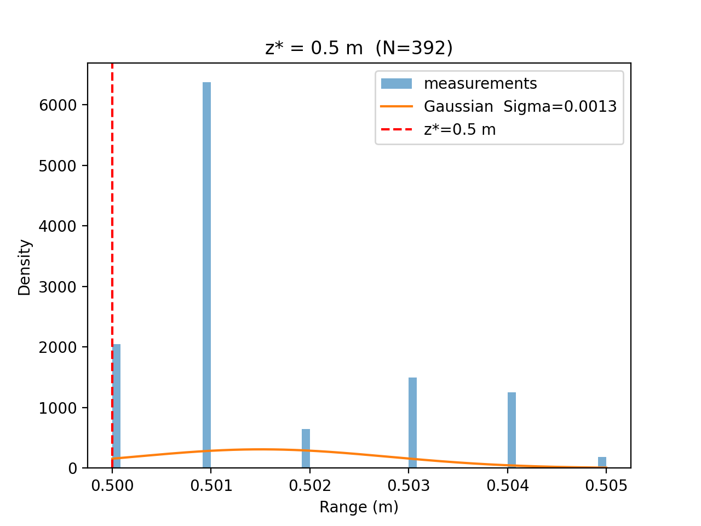
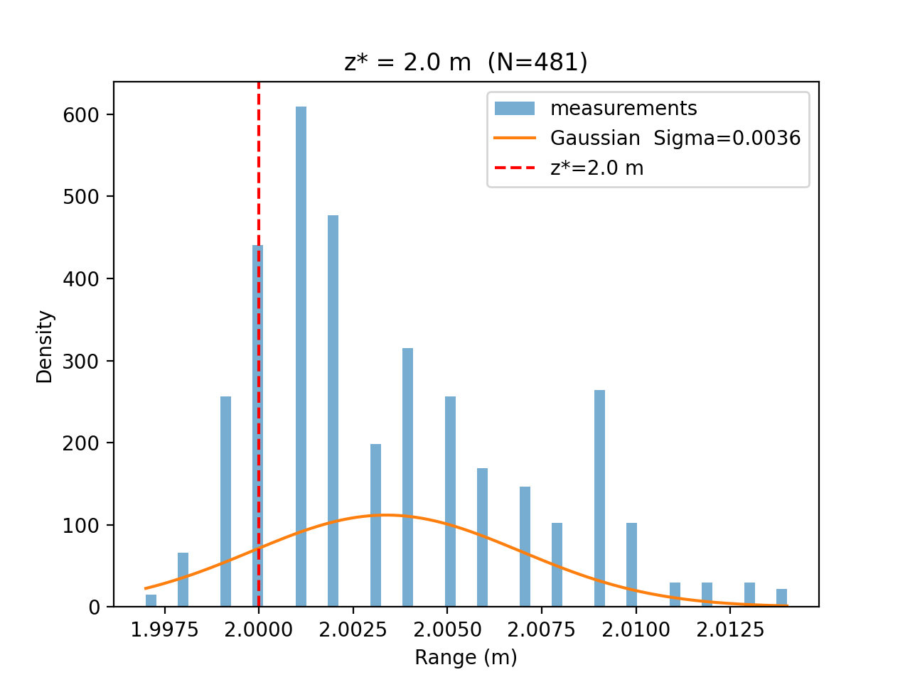
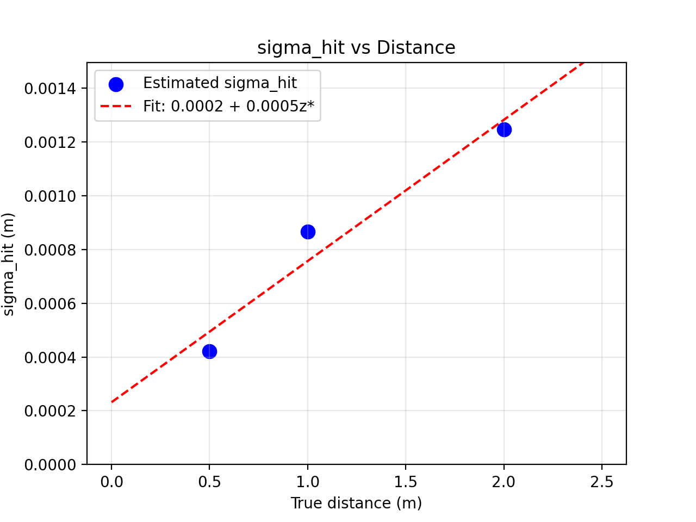

# Project 5: Laser Range Finder Intrinsic Parameter Estimation

**Anders Smitterberg · Progress Munoriarwa**  
EE5531 Intro to Robotics

---

## 1. Introduction and Methodology

### Beam Model Overview

<!-- TODO: 2-3 sentences describing Thrun's Beam Model and its four components
     (p_hit, p_short, p_max, p_rand). Explain why we care about sigma_hit
     and what it tells us about the sensor. -->

### Calibration Approach

- Place robot perpendicular to a flat wall at a known distance
- Record /scan data to a ROS2 bag at multiple distances
- Offline: extract front-facing beams, fit Gaussian, estimate sigma_hit
- Compare distributions against beam model predictions

### Data Collection Procedure

| Distance (m) | Bag file | Duration (s) | Approx. samples |
|:---:|---|:---:|:---:|
| 0.5 | `data/rosbag_0_5m` | <!-- TODO --> | <!-- TODO --> |
| 1.0 | `data/rosbag_1m`   | <!-- TODO --> | <!-- TODO --> |
| 2.0 | `data/rosbag_2m`   | <!-- TODO --> | <!-- TODO --> |


Using two meter sticks and several two by four pieces of lumber we attempted to position the front of the LDS as close to the nominal distance as possible. using the rostopic echo command we then fine tuned the distance until the first measurement of the bag was as close as possible to the nominal distance. We ensured the robot was perpendicular to the wall by sight. The scan rate was approximately 5hz. By scanning for approximately ten seconds for each bag we got a reasonable amount of data. In hindsight a much longer time would have been preferred.

### Challenges and How They Were Addressed


---

## 2. Histogram Analysis


### 0.5 m



The distribution's mode is approximately at 501mm. the distribution I would not call gaussian. there are visible tails and clusters, but the total range of the measurements is still quite small at about 5mm. Interestingly there are very few short measurements. 

### 1.0 m


The measured distribution reads long, the mean is at 1007 mm, which is substantially longer than anticipated, this is likley measurement error. The distribution has much less variance than the 0.5m distribution, but also has more clearly defined tails.

### 2.0 m



It appears as though the standard deviation increases greatly in this distribution. the mean is slighyly higher than the nominal measurement value, and the distribution appears much more gaussian. 

### Distribution Shape Discussion

Across all the measurements it appears although the p_hit dominates. There do not appear to be any short measurements, other than potentially a tail on the 1.0m distribution. Additionally there didn't appear to be any "long" measurements on the sensor. if there were they were already likley clipped by the firmware. If I had to characteize these distribution I would have preferred longer rosbags, and I suspect they would have converged to a gaussian appearing distribution. I believe that p_hit appears to dominate, and for simplicity's sake I believe is sufficient to characterize this sensor's performance.

---

## 3. Parameter Estimation and Results

### Estimated Parameters per Distance

| z\* (m) | N | Mean (m) | Bias (m) | σ_hit (m) | Outlier rate | Short rate |
|:---:|:---:|:---:|:---:|:---:|:---:|:---:|
| 0.5 | 392 | 0.5015 | 0.0015 | 0.0013 | 0.00 | 0.00 |
| 1.0 | 416 | 1.0068 | 0.0068| 0.0015 | 0.00 | 0.00 |
| 2.0 | 481 | 2.0034 | 0.0034 | 0.0036 | 0.00 | 0.00 |

### σ_hit vs Distance




### Proposed Uncertainty Model


### Outlier Rates and Mixing Weight Discussion


---

## 4. Analysis Questions

**Q1. Does the measurement distribution match the Gaussian assumption of p_hit?**

Yes with some caveats. It appears as thought the gaussian distribution appears with larger measurement distances. I believe with more measurements over a longer time we would be more likley to see this emerge. I think that a gaussian centered on the mean is a reasonable assumption for the distributions. The only real outlier in my mind is 1m which has some distinct looking tails. 

**Q2. How does measurement uncertainty vary with distance?**


**Q3. Were there systematic biases? How would you correct for them?**


---

## 5. Usage Instructions

### Build the ROS2 Package

```bash
cd ~/proj5_ws
colcon build --packages-select lidar_calibration
source install/setup.bash
```

### Run the Calibration Node

Run with default parameters (target distance = 1.0 m, target angle = 0 rad, angle window = 0.1 rad):

```bash
ros2 run lidar_calibration calibration_node
```

Run with a specific target distance (e.g. 0.5 m):

```bash
ros2 run lidar_calibration calibration_node --ros-args -p target_distance:=0.5
```

Run with all parameters specified:

```bash
ros2 run lidar_calibration calibration_node --ros-args \
  -p target_distance:=2.0 \
  -p target_angle:=0.0 \
  -p angle_window:=0.1
```

### Play Back a Recorded Bag

```bash
ros2 bag play data/rosbag_1m
```

Then in a second terminal, run the node with the matching target distance:

```bash
ros2 run lidar_calibration calibration_node --ros-args -p target_distance:=1.0
```

### Monitor Published Topics

```bash
# Current measurement error (z - z*)
ros2 topic echo /calibration/range_error

# Running sigma_hit estimate
ros2 topic echo /calibration/statistics
```

---

*Generative artificial intelligence was used by Anders Smitterberg to assist with developing and debugging the `calibration_node.py` and `analyze_lidar_bag.py` scripts, and for formatting this README.*
