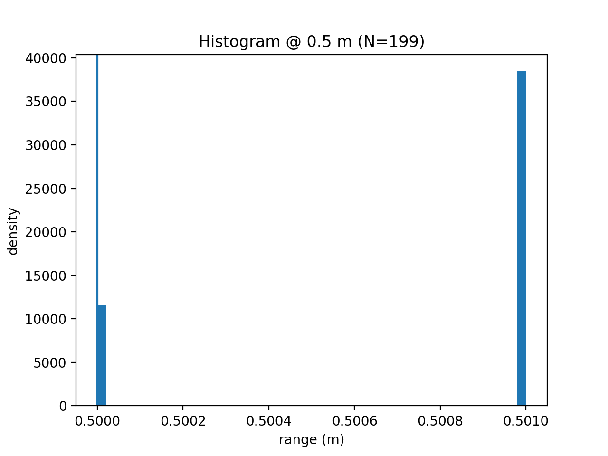
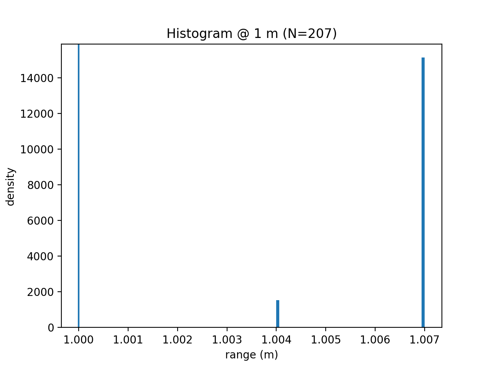
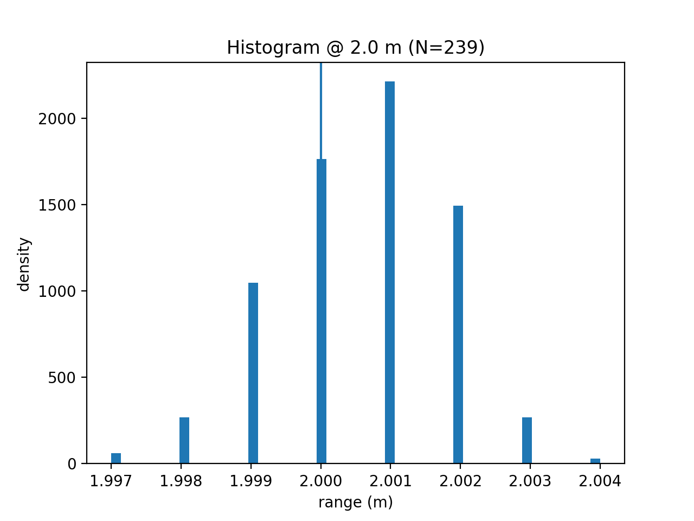

# Project 5: Laser Range Finder Intrinsic Parameter Estimation

**Anders Smitterberg · Progress Munoriarwa** — EE5531 Intro to Robotics

---

## 1. Introduction and Methodology

### Beam Model Overview

<!-- TODO: 2-3 sentences describing Thrun's Beam Model and its four components
     (p_hit, p_short, p_max, p_rand). Explain why we care about sigma_hit
     and what it tells us about the sensor. -->

### Calibration Approach

<!-- TODO: Describe the overall approach:
     - Place robot perpendicular to a flat wall at a known distance
     - Record /scan data to a ROS2 bag at multiple distances
     - Offline: extract front-facing beams, fit Gaussian, estimate sigma_hit
     - Compare distributions against beam model predictions -->

### Data Collection Procedure

| Distance (m) | Bag file | Duration (s) | Approx. samples |
|:---:|---|:---:|:---:|
| 0.5 | `data/rosbag_0_5m` | <!-- TODO --> | <!-- TODO --> |
| 1.0 | `data/rosbag_1m`   | <!-- TODO --> | <!-- TODO --> |
| 2.0 | `data/rosbag_2m`   | <!-- TODO --> | <!-- TODO --> |

<!-- TODO: Describe setup details:
     - How you measured the true distance (tape measure, etc.)
     - How you verified the robot was perpendicular to the wall
     - Scan rate of the sensor and resulting sample count -->

### Challenges and How They Were Addressed

<!-- TODO: Note any issues you encountered, e.g.:
     - QoS mismatch when subscribing to /scan (BEST_EFFORT fix)
     - Uncertainty in true distance measurement
     - Any reflections or environmental noise -->

---

## 2. Histogram Analysis

Progress I plotted your fifgures here

### 0.5 m



<!-- TODO: Describe the distribution shape at 0.5 m.
     - Is it roughly Gaussian? Symmetric?
     - Are there visible tails or outlier clusters?
     - Does the mean align with the true distance line? -->

### 1.0 m



<!-- TODO: Same description for 1.0 m. Note any changes vs 0.5 m. -->

### 2.0 m



<!-- TODO: Same description for 2.0 m.
     - Does the spread visibly increase with distance?
     - More or fewer outliers? -->

### Distribution Shape Discussion

<!-- TODO: Across all three distances, discuss:
     - Whether the p_hit Gaussian component dominates
     - Evidence (or lack thereof) for p_short (unexpected short readings)
     - Evidence for p_max (sensor reporting max range)
     - Whether the full four-component beam model is warranted by this data,
       or whether a simple Gaussian is sufficient -->

---

## 3. Parameter Estimation and Results

### Estimated Parameters per Distance

| z\* (m) | N | Mean (m) | Bias (m) | σ_hit (m) | Outlier rate | Short rate |
|:---:|:---:|:---:|:---:|:---:|:---:|:---:|
| 0.5 | <!-- TODO --> | <!-- TODO --> | <!-- TODO --> | <!-- TODO --> | <!-- TODO --> | <!-- TODO --> |
| 1.0 | <!-- TODO --> | <!-- TODO --> | <!-- TODO --> | <!-- TODO --> | <!-- TODO --> | <!-- TODO --> |
| 2.0 | <!-- TODO --> | <!-- TODO --> | <!-- TODO --> | <!-- TODO --> | <!-- TODO --> | <!-- TODO --> |

### Beam Model Mixing Weights

| z\* (m) | z_hit | z_short | z_max | z_rand |
|:---:|:---:|:---:|:---:|:---:|
| 0.5 | <!-- TODO --> | <!-- TODO --> | <!-- TODO --> | <!-- TODO --> |
| 1.0 | <!-- TODO --> | <!-- TODO --> | <!-- TODO --> | <!-- TODO --> |
| 2.0 | <!-- TODO --> | <!-- TODO --> | <!-- TODO --> | <!-- TODO --> |

### σ_hit vs Distance


<!-- TODO: Describe the trend in sigma_hit across distances.
     - Does it grow linearly? Stay flat? -->

### Proposed Uncertainty Model

<!-- TODO: Report the fitted linear model from your analysis:


     Justify whether the linear model is a good fit or whether a simpler
     constant model is adequate. Compare to the LDS-01 spec (±30 mm). -->

### Outlier Rates and Mixing Weight Discussion

<!-- TODO: Discuss whether z_hit is close to 1.0 at all distances
     (meaning the sensor is well-behaved) or whether significant fractions
     of z_short / z_rand / z_max are present and what caused them. -->

---

## 4. Analysis Questions

**Q1. Does the measurement distribution match the Gaussian assumption of p_hit?**

<!-- TODO: Reference your Q-Q plots and Shapiro-Wilk results.
     State whether the Gaussian assumption holds and at which distances
     it breaks down (if any). Discuss what deviations you observed. -->

**Q2. How does measurement uncertainty vary with distance?**

<!-- TODO: Quantify the trend using your fitted σ₀ and σ₁.
     State whether uncertainty increases meaningfully over the 0.5–2.0 m
     range tested or whether it is approximately constant. -->

**Q3. Were there systematic biases? How would you correct for them?**

<!-- TODO: Report the bias at each distance from your results table.
     If the bias is roughly constant, suggest a fixed additive correction.
     If it scales with distance, suggest a multiplicative correction factor.
     Note possible sources: robot not fully perpendicular, tape measure
     placement (front of robot vs LiDAR origin), etc. -->

---

## 5. Usage Instructions

### Build the ROS2 Package

```bash
cd ~/proj5_ws
colcon build --packages-select lidar_calibration
source install/setup.bash
```

need to finish when node is actually written and functional.

